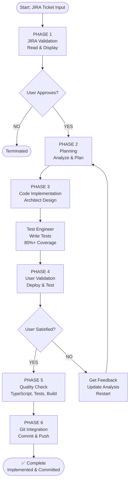

# System Overview

## 📊 Complete Workflow Flowchart



## 🎯 Complete Workflow

```
INPUT: JIRA Ticket (jira-details.txt)
  ↓
PHASE 1: JIRA Validation
  • Read ticket from file
  • Display details to user
  • Get YES/NO confirmation
  ↓ (YES)
PHASE 2: Implementation Planning
  • Analyze existing React project
  • Plan what needs to be built
  ↓
PHASE 3: Code Implementation (Sequential Agents)
  1. Architect → Design solution
  2. UI Dev → Implement components
  3. Test Eng → Write tests (80%+ coverage)
  ↓
PHASE 4: User Validation
  • Run locally
  • User tests feature
  • Ask: "Does this meet requirements?"
  ├─ YES → Go to Phase 5
  └─ NO → Collect feedback → Restart from Phase 2 ↻
  ↓
PHASE 5: Quality Validation
  • TypeScript check
  • Run test suite (80%+ coverage)
  • Build verification
  • No console errors
  ↓
PHASE 6: Git Integration
  • Stage changes
  • Create commit with ticket reference
  • Push to repository
  ↓
OUTPUT: Feature implemented, tested, approved, and committed ✅
```


## 📁 What Each File/Folder Does

| Location | Purpose |
|----------|---------|
| `.agents/` | Directory containing 8 specialized agents: jira-validator.md, orchestrator.md, architect.md, ui-developer.md, test-engineer.md, user-validator.md, qa-validator.md, gitops.md |
| `.context/jira-details.txt` | JIRA ticket data (auto-fetched via MCP) |
| `docs/WORKFLOW.md` | Detailed explanation of all 6 phases |
| `docs/ARCHITECTURE.md` | System design and component breakdown |
| `docs/IMPLEMENTATION.md` | Build roadmap and implementation details |
| Root `README.md` | Project overview and quick start |
| Root `PLAN.md` | Executive summary |

## 🤖 The 8 Specialized Agents (Execution Order)

1. **JIRA Validator Agent** → Read jira-details.txt, show to user, get YES/NO
2. **Orchestrator Agent** → Plan how to implement the ticket
3. **Architect Agent** → Design the solution (components, data flow)
4. **UI Developer Agent** → Build components and integrate with existing code
5. **Test Engineer Agent** → Write tests (must maintain 80%+ coverage)
6. **User Validator Agent** → Deploy locally, user tests, gives YES/NO
   - If YES → Go to next agent
   - If NO → Collect feedback, restart from step 2 with new analysis
7. **QA Validator Agent** → Automated checks (TypeScript, tests, build, no errors)
8. **GitOps Agent** → Commit changes and push to repository

---

## ✅ Key Points to Remember

- **Input:** Single JIRA ticket from `jira-details.txt`
- **Process:** 6 phases with user validation at Phase 4
- **Iteration:** If user says NO at Phase 4, system restarts automatically with new requirements
- **Output:** Feature fully implemented, tested, approved by user, and committed to git
- **Quality:** Must maintain 80%+ test coverage throughout
- **Safety:** User must approve before code is committed